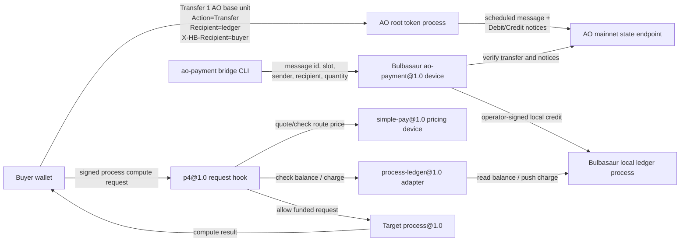

# Bulbasaur HyperBEAM Node

This checkout is configured to run a paid process-execution and paid bundler
node using `p4@1.0` as the request/response hook, `simple-pay@1.0` for static
route pricing, `metering@1.0` for dynamic bundler byte pricing, and
`process-ledger@1.0` as the adapter to a local AO-token sub-ledger.

Start it with:

```sh
./scripts/start-bulbasaur.sh
```

Keep that process running. The script intentionally stays attached so the
Bulbasaur HTTP listener remains alive.

On startup it prints:

- the node URL
- the operator address
- the configured AO root token process ID
- the Bulbasaur ledger process ID

## New Components

This branch adds the following Bulbasaur-specific pieces:

- `src/dev_ao_payment.erl`: HyperBEAM device registered as `ao-payment@1.0`.
  It verifies AO root-token transfers against the configured AO mainnet state
  endpoint, requires both `Debit-Notice` and `Credit-Notice`, prevents duplicate
  imports, and then posts an operator-signed local credit into the Bulbasaur
  ledger.
- `src/dev_process_ledger.erl`: HyperBEAM device registered as
  `process-ledger@1.0`. It lets `p4@1.0` read balances from the local ledger
  process and push operator-signed charge, reserve, release, and refund
  messages back into it.
- `src/dev_bundler_escrow.erl`: bundler escrow helper. It quotes uploads with
  `metering@1.0`, reserves uploader funds before the item is cached/queued,
  releases funds to the operator after `bundle_complete`, and refunds if the
  pre-bundle cache step fails after a reservation.
- `src/dev_bundler.erl`, `src/dev_bundler_cache.erl`, and
  `src/dev_bundler_recovery.erl`: extend Sam's metered bundler flow with
  reservation metadata, cache/recovery support, and completion-time release.
- `scripts/hyper-token-p4.lua`: extends the local token ledger with
  reservation state for `reserve`, `release`, and `refund`.
- `src/hb_opts.erl`: preloads `ao-payment@1.0` so the verifier device is
  available through the normal HyperBEAM device map, and preloads
  `process-ledger@1.0` for the p4 ledger adapter.
- `scripts/start-bulbasaur.erl` and `scripts/start-bulbasaur.sh`: start the
  paid node, create/load the local ledger process, wire `p4@1.0` and
  `simple-pay@1.0`, and print the runtime IDs needed for testing.
- `scripts/ao-payment-bridge.mjs`: command-line bridge that calls the local
  `~ao-payment@1.0` device. It does not talk to AO services directly; the
  HyperBEAM device performs the verification and local ledger import.
- `scripts/e2e-buy-process-execution.sh`: real end-to-end buyer flow. It sends
  a tiny AO transfer, waits for the scheduled slot, imports the verified payment
  into Bulbasaur, and spends that balance on a real process compute request.
- `scripts/spend-imported-balance.erl`: sends the signed paid compute request
  used after a payment has been imported into the local ledger.
- `src/bulbasaur_e2e.erl`, `scripts/e2e-bulbasaur.erl`, and
  `scripts/e2e-bulbasaur.sh`: local regression test for the paid-route behavior
  using a real `process@1.0` and local ledger credit.
- `scripts/bulbasaur-process.lua`: minimal Lua counter process used as the real
  process target in the E2E flow.
- `BULBASAUR.md`: operator notes for running, paying, bridging, and testing this
  node setup.

## Architecture



Run the local payment E2E check with:

```sh
HB_PORT=18913 ./scripts/e2e-bulbasaur.sh
```

That test starts a node, deploys a real `process@1.0` with a local
`lua@5.3a` module, proves an unfunded signed compute gets `402`, then checks a
funded signed compute against the same deployed process and verifies the funded
client was debited by the configured route price. The test keeps the live AO
root token process ID in the ledger `token` field, but seeds the local
sub-ledger balance directly, so it verifies the paid route logic without
depending on a live AO transfer during test execution.

Defaults:

- HTTP port: `8734`, override with `HB_PORT=10001`.
- Operator wallet: `bulbasaur-wallet.json`, override with `HB_KEY=/path/to/wallet.json`.
- AO root token process: `0syT13r0s0tgPmIed95bJnuSqaD29HQNN8D3ElLSrsc`, override with `BULBASAUR_AO_TOKEN=<process-id>`.
- Process route price: `1` AO base unit, override with `BULBASAUR_PROCESS_PRICE=25`.
- Bundler upload byte price: `1162726` AO base units per bundled byte,
  override with `BULBASAUR_BUNDLER_BYTE_PRICE=2`. The default approximates
  `$0.0025797/KiB` at `$2.60/AO` plus a 20% operator premium.
- Bundler item dispatch threshold: `1000` items by default, override with
  `BULBASAUR_BUNDLER_MAX_ITEMS=1` for local smoke testing.
- Bundler dispatch timer: the first queued item starts the bundler's
  `bundler-max-bundle-dispatch-delay`, which defaults to `30000` ms in
  `dev_bundler`. This is separate from `BULBASAUR_BUNDLER_MAX_IDLE_MS`, which
  controls bundler server idle shutdown.
- Paid route template: `/.*~process@1.0/.*`.
- Paid bundler route template: `/~bundler@1.0/tx`.
- Generic non-process routes are free because `simple-pay-price` is set to `0`.
  Bundler uploads are priced dynamically by `metering@1.0`, not by the static
  route price.

Bundler payment flow:

1. The uploader submits a signed ANS-104 data item to `/~bundler@1.0/tx`.
2. The bundler calculates the bundled byte size and asks `metering@1.0` for a
   quote.
3. `process-ledger@1.0` reserves the quoted AO base units from the uploader in
   the local ledger process before the item is cached or queued.
4. After the bundle tx is posted and chunks/proofs are seeded,
   `bundle_complete` releases the reservation to the operator.
5. If the reservation succeeds but pre-queue cache writing fails, the bundler
   attempts to refund the reservation.

`bundle_complete` is the bundler's "posted and seeded" signal. It is not an
Arweave finality confirmation, but it is the point at which the operator has
completed the bundling job.

The important token selector is not a knob on `p4@1.0`. It is the ledger
process definition's `token` field. In this checkout, `BULBASAUR_AO_TOKEN`
feeds that field on the local ledger process.

## Paying for Compute with AO

1. Start Bulbasaur and note the printed `Ledger AO funding account` value.
2. Transfer AO to the ledger process using the AO mainnet flow. Keep the
   returned message ID and assignment slot.
3. Run the local AO payment bridge. It calls Bulbasaur's `~ao-payment@1.0`
   device, which verifies the transfer against the configured AO mainnet state
   endpoint (`https://state.forward.computer`) and imports the verified credit
   into the local Bulbasaur ledger.
4. Check your Bulbasaur balance on the Bulbasaur node at
   `GET /<ledger-id>~process@1.0/now/balance/<your-wallet-address>`.
5. Deploy or target a process on Bulbasaur.
6. Send a signed compute request to `GET /<ProcessID>~process@1.0/compute`.

The root-token transfer is not sent to the Bulbasaur HTTP node. It is sent to
the AO token process itself. The bridge verifies the resulting AO
`Debit-Notice` and `Credit-Notice` before sending an operator-signed local
credit into Bulbasaur. It must not use the AO testnet CU/MU endpoints for this
mainnet AO token flow.

Transfer messages should be submitted with `returnAssignmentSlot: true` so the
slot can be passed to the HyperBEAM verifier.

Bridge import example:

```sh
node scripts/ao-payment-bridge.mjs \
  --message-id <AO transfer message ID> \
  --slot <AO assignment slot> \
  --sender <payer wallet address> \
  --node http://localhost:8734 \
  --ledger <Bulbasaur ledger process ID> \
  --quantity 1
```

`--quantity 1` is one AO base unit (`0.000000000001 AO`). To verify without
importing, add `--verify-only`.

The device verifies:

- the scheduled AO message at the supplied slot is the expected transfer
- the computed result contains the expected `Debit-Notice` and `Credit-Notice`
- the notice target is the Bulbasaur ledger process
- the sender, credited recipient, and quantity match
- the AO payment id has not already been imported by this node process

Example balance check on the Bulbasaur node:

```sh
curl http://localhost:8734/<ledger-id>~process@1.0/now/balance/YOUR_WALLET_ADDRESS
```

Example signed compute request:

```erlang
Wallet = hb:wallet(<<"my-wallet.json">>).
Req = hb_message:commit(
    #{
        <<"path">> => <<"/", ProcID/binary, "~process@1.0/compute">>,
        <<"slot">> => 0
    },
    #{ <<"priv-wallet">> => Wallet }
).
hb_http:get(<<"http://localhost:8734">>, Req, #{}).
```

For the AO deposit itself, schedule a transfer on the root AO token process with:

```text
action = "Transfer"
recipient = "<Bulbasaur ledger process ID>"
quantity = "<amount>"
X-HB-Recipient = "<local ledger account to credit>"
```

With `@permaweb/aoconnect`, that is the tag set:

```js
[
  { name: "Action", value: "Transfer" },
  { name: "Recipient", value: "<Bulbasaur ledger process ID>" },
  { name: "Quantity", value: "<amount>" },
  { name: "X-HB-Recipient", value: "<local ledger account to credit>" }
]
```

To verify your root-token balance before or after the transfer, query the AO
root token with:

```js
[
  { name: "Action", value: "Balance" },
  { name: "Recipient", value: "<your-wallet-address>" }
]
```

If the transfer succeeds, Bulbasaur should then report that balance at
`GET /<ledger-id>~process@1.0/now/balance/YOUR_WALLET_ADDRESS`, and each paid
compute should debit it by `BULBASAUR_PROCESS_PRICE` AO base units.
