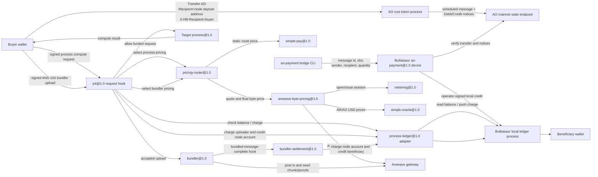
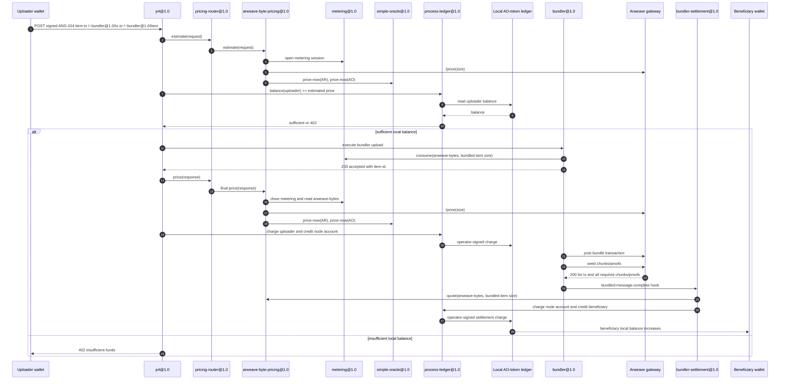

# Bulbasaur HyperBEAM Node

This checkout is configured to run paid process execution and paid bundling
using `p4@1.0` as the request/response hook, `pricing-router@1.0` to select a
pricing device per route, `arweave-byte-pricing@1.0` for bundler uploads, and
`process-ledger@1.0` as the adapter to a local AO-token ledger process.

Start it with:

```sh
./scripts/start-bulbasaur.sh
```

Keep that process running. The script intentionally stays attached so the
Bulbasaur HTTP listener remains alive.

On startup it prints:

- the node URL
- the operator address
- the configured AO root token process ID
- the Bulbasaur ledger process ID
- the AO deposit address

## New Components

This branch adds the following Bulbasaur-specific pieces:

- `src/dev_ao_payment.erl`: HyperBEAM device registered as `ao-payment@1.0`.
  It verifies AO root-token transfers against the configured AO mainnet state
  endpoint, requires both `Debit-Notice` and `Credit-Notice`, prevents duplicate
  imports, and then posts an operator-signed local credit into the Bulbasaur
  ledger.
- `src/dev_process_ledger.erl`: HyperBEAM device registered as
  `process-ledger@1.0`. It lets `p4@1.0` read balances from the local ledger
  process and push operator-signed charge messages back into it.
- `src/dev_pricing_router.erl`: HyperBEAM pricing-device adapter registered as
  `pricing-router@1.0`. It keeps static process route pricing on
  `simple-pay@1.0`, while routing bundler uploads to
  `arweave-byte-pricing@1.0`.
- `src/dev_simple_oracle.erl` and `src/dev_arweave_byte_pricing.erl`: narrow
  devices for `price-now(ticker)` and Arweave-byte-to-AO-base-unit pricing. The
  pricing adapter uses canonical `metering@1.0`, `arweave@2.9/price`, and
  `simple-oracle@1.0`.
- `src/dev_bundler_settlement.erl`: bundle-completion hook handler registered
  as `bundler-settlement@1.0`. It runs after the bundler has posted and seeded
  the bundle, prices each completed item with `arweave-byte-pricing@1.0`, and
  transfers the local ledger balance from the node account to the beneficiary
  account.
- `src/dev_arweave.erl`, `src/dev_copycat_arweave.erl`,
  `src/hb_store_arweave.erl`, and `src/hb_store_arweave_offset.erl`: pending
  Arweave/copycat indexing support. Bulbasaur serves newly accepted data items
  from its local cache immediately, then runs mempool copycat after bundle
  completion so pending bundle/item offsets are available before gateway
  indexing catches up.
- `src/hb_opts.erl`: preloads `ao-payment@1.0` so the verifier device is
  available through the normal HyperBEAM device map, and preloads
  `process-ledger@1.0`, `pricing-router@1.0`, `simple-oracle@1.0`,
  `arweave-byte-pricing@1.0`, and `bundler-settlement@1.0`.
- `scripts/start-bulbasaur.erl` and `scripts/start-bulbasaur.sh`: start the
  paid node, create/load the local ledger process, wire `p4@1.0` and
  `simple-pay@1.0`, and print the runtime IDs needed for testing.
- `scripts/ao-payment-bridge.mjs`: command-line bridge that calls the local
  `~ao-payment@1.0` device. It does not talk to AO services directly; the
  HyperBEAM device performs the verification and local ledger import.
- `scripts/e2e-buy-process-execution.sh`: real end-to-end buyer flow. It sends
  a tiny AO transfer, waits for the scheduled slot, imports the verified payment
  into Bulbasaur, and spends that balance on a real process compute request.
- `scripts/spend-imported-balance.erl`: sends the signed paid compute request
  used after a payment has been imported into the local ledger.
- `src/bulbasaur_e2e.erl`, `scripts/e2e-bulbasaur.erl`, and
  `scripts/e2e-bulbasaur.sh`: local regression test for the paid-route behavior
  using a real `process@1.0` and local ledger credit.
- `scripts/bulbasaur-process.lua`: minimal Lua counter process used as the real
  process target in the E2E flow.
- `BULBASAUR.md`: operator notes for running, paying, bridging, and testing this
  node setup.

## Architecture



Run the local payment E2E check with:

```sh
HB_PORT=18913 ./scripts/e2e-bulbasaur.sh
```

That test starts a node, deploys a real `process@1.0` with a local
`lua@5.3a` module, proves an unfunded signed compute gets `402`, then checks a
funded signed compute against the same deployed process and verifies the funded
client was debited by the configured route price. The test keeps the live AO
root token process ID in the ledger `token` field, but seeds the local
sub-ledger balance directly, so it verifies the paid route logic without
depending on a live AO transfer during test execution.

Defaults:

- HTTP port: `8734`, override with `HB_PORT=10001`.
- Operator wallet: `bulbasaur-wallet.json`, override with `HB_KEY=/path/to/wallet.json`.
- AO root token process: `0syT13r0s0tgPmIed95bJnuSqaD29HQNN8D3ElLSrsc`, override with `BULBASAUR_AO_TOKEN=<process-id>`.
- Process route price: `1` AO base unit, override with `BULBASAUR_PROCESS_PRICE=25`.
- Bundler upload byte price: dynamic by default. `arweave-byte-pricing@1.0`
  asks `arweave@2.9` for `/price` and converts the AR winston cost to AO base
  units using `simple-oracle@1.0` AR/AO USD prices. Override with
  `BULBASAUR_BUNDLER_BYTE_PRICE=2` for fixed local testing.
- Bundler item dispatch threshold: `1000` items by default, override with
  `BULBASAUR_BUNDLER_MAX_ITEMS=1` for local smoke testing.
- Bundler dispatch delay: `2000` ms by default, override with
  `BULBASAUR_BUNDLER_DISPATCH_MS=30000` for slower batching.
- Bundler beneficiary: defaults to the node/operator wallet, override with
  `BULBASAUR_BENEFICIARY=<wallet-address>`.
- Bundler optimistic cache: enabled. Accepted data items can be read from the
  node immediately through the local cache, and completed bundles trigger
  `~copycat@1.0/arweave&mode=mempool` with a sender filter for the node wallet.
- Confirmed Arweave indexing: enabled by default. The startup script starts an
  internal worker that runs `~copycat@1.0/arweave?from=-1&to=-10` every
  `5-minutes`, so data items that were first indexed through the mempool get
  rewritten to durable confirmed Arweave offsets after their bundle is mined.
  Override the window with `BULBASAUR_ARWEAVE_BLOCK_COPYCAT_DEPTH=50`, override
  the cadence with `BULBASAUR_ARWEAVE_BLOCK_COPYCAT_INTERVAL=1-minute`, or
  disable it with `BULBASAUR_ARWEAVE_BLOCK_COPYCAT_INTERVAL=false`.
- Paid route template: `/.*~process@1.0/.*`.
- Paid bundler route templates: `/~bundler@1.0/tx` and
  `/~bundler@1.0/item`.
- Generic non-process routes are free because `simple-pay-price` is set to `0`.
  Bundler uploads are priced dynamically by `arweave-byte-pricing@1.0`, not by
  the static route price.

## Paid Bundling Flow



There is no custom escrow helper in this model. The user's local ledger balance
is debited when P4 successfully returns the bundler POST response, crediting the
node's local ledger account. The delay between that accepted upload and
`bundled-message-complete` is the settlement window. After `bundle_complete`
has posted the transaction and seeded all required chunks/proofs, the
`bundled-message-complete` hook settles the same priced amount from the node
account to the configured beneficiary.

`bundle_complete` is the bundler's "posted and seeded" signal. It is not an
Arweave finality confirmation, but it is the point at which the local bundling
job has completed. A regression test verifies that the completion hook does not
fire while chunk seeding is still failing.

The raw ANS-104 upload route is covered by the same P4/pricing protection as
the `tx` alias. A regression test verifies that an unfunded signed upload to
`/~bundler@1.0/item?codec-device=ans104@1.0` returns `402` before the bundler
posts any transaction or chunk request to Arweave.

The bundler has two optimistic read paths:

- Immediately after a signed item is accepted, `~arweave@2.9/raw=<item-id>` can
  fall back to the node's local upload cache, even before the item has been
  dispatched in an L1 bundle.
- After the bundle is posted and seeded, Bulbasaur starts a background
  mempool-copycat pass for that exact bundle transaction. That writes pending
  Arweave offset entries for the bundle and its child items, allowing Arweave
  style reads to work before public gateways have indexed the bundle.

The important token selector is not a knob on `p4@1.0`. It is the ledger
process definition's `token` field. In this checkout, `BULBASAUR_AO_TOKEN`
feeds that field on the local ledger process.

## Paying for Compute with AO

1. Start Bulbasaur and note the printed `AO deposit address` value.
2. Transfer AO to that node deposit address using the AO mainnet flow. Keep the
   returned message ID and assignment slot.
3. Run the local AO payment bridge. It calls Bulbasaur's `~ao-payment@1.0`
   device, which verifies the transfer against the configured AO mainnet state
   endpoint (`https://state.forward.computer`) and imports the verified credit
   into the local Bulbasaur ledger.
4. Check your Bulbasaur balance on the Bulbasaur node at
   `GET /<ledger-id>~process@1.0/now/balance/<your-wallet-address>`.
5. Deploy or target a process on Bulbasaur.
6. Send a signed compute request to `GET /<ProcessID>~process@1.0/compute`.

The root-token transfer is not sent to the Bulbasaur HTTP node or to the local
ledger process. It is sent to the AO token process itself with the node's
deposit address as the recipient. The bridge verifies the resulting AO
`Debit-Notice` and `Credit-Notice` before sending an operator-signed local
credit into Bulbasaur. It must not use the AO testnet CU/MU endpoints for this
mainnet AO token flow.

Transfer messages should be submitted with `returnAssignmentSlot: true` so the
slot can be passed to the HyperBEAM verifier.

Bridge import example:

```sh
node scripts/ao-payment-bridge.mjs \
  --message-id <AO transfer message ID> \
  --slot <AO assignment slot> \
  --sender <payer wallet address> \
  --node http://localhost:8734 \
  --ledger <Bulbasaur ledger process ID> \
  --quantity 1
```

`--quantity 1` is one AO base unit (`0.000000000001 AO`). To verify without
importing, add `--verify-only`.

The device verifies:

- the scheduled AO message at the supplied slot is the expected transfer
- the computed result contains the expected `Debit-Notice` and `Credit-Notice`
- the notice target is the Bulbasaur AO deposit address
- the sender, credited recipient, and quantity match
- the AO payment id has not already been imported by this node process

## Validation Status

Focused paid-bundler validation passes:

```sh
HB_PORT=19115 rebar3 eunit --module=dev_metering
```

This covers metered pricing, query-string upload paths, the P4 response charge,
and the unfunded raw upload rejection.

The broader bundler suite also passed during validation:

```sh
HB_PORT=19116 rebar3 eunit --module=dev_bundler
```

This includes the optimistic raw-cache regression for accepted bundler uploads.

The repository-wide EUnit command must be run on a free HTTP port because
`8734` is commonly occupied by a local Bulbasaur node:

```sh
HB_PORT=19116 rebar3 eunit
```

At the time this note was added, that full suite did not pass cleanly:
`17 failed, 280 passed`. The failures were in pre-existing cache/link-loading
and WASM/JSON interface tests, not in the paid bundler, metering, bundler
settlement, AO payment, or process-ledger modules. Treat the paid bundler flow
as validated by the focused tests and end-to-end script, not by a green
repository-wide suite.

Example balance check on the Bulbasaur node:

```sh
curl http://localhost:8734/<ledger-id>~process@1.0/now/balance/YOUR_WALLET_ADDRESS
```

Example signed compute request:

```erlang
Wallet = hb:wallet(<<"my-wallet.json">>).
Req = hb_message:commit(
    #{
        <<"path">> => <<"/", ProcID/binary, "~process@1.0/compute">>,
        <<"slot">> => 0
    },
    #{ <<"priv-wallet">> => Wallet }
).
hb_http:get(<<"http://localhost:8734">>, Req, #{}).
```

For the AO deposit itself, schedule a transfer on the root AO token process with:

```text
action = "Transfer"
recipient = "<Bulbasaur AO deposit address>"
quantity = "<amount>"
X-HB-Recipient = "<local ledger account to credit>"
```

With `@permaweb/aoconnect`, that is the tag set:

```js
[
  { name: "Action", value: "Transfer" },
  { name: "Recipient", value: "<Bulbasaur AO deposit address>" },
  { name: "Quantity", value: "<amount>" },
  { name: "X-HB-Recipient", value: "<local ledger account to credit>" }
]
```

To verify your root-token balance before or after the transfer, query the AO
root token with:

```js
[
  { name: "Action", value: "Balance" },
  { name: "Recipient", value: "<your-wallet-address>" }
]
```

If the transfer succeeds, Bulbasaur should then report that balance at
`GET /<ledger-id>~process@1.0/now/balance/YOUR_WALLET_ADDRESS`, and each paid
compute should debit it by `BULBASAUR_PROCESS_PRICE` AO base units.
